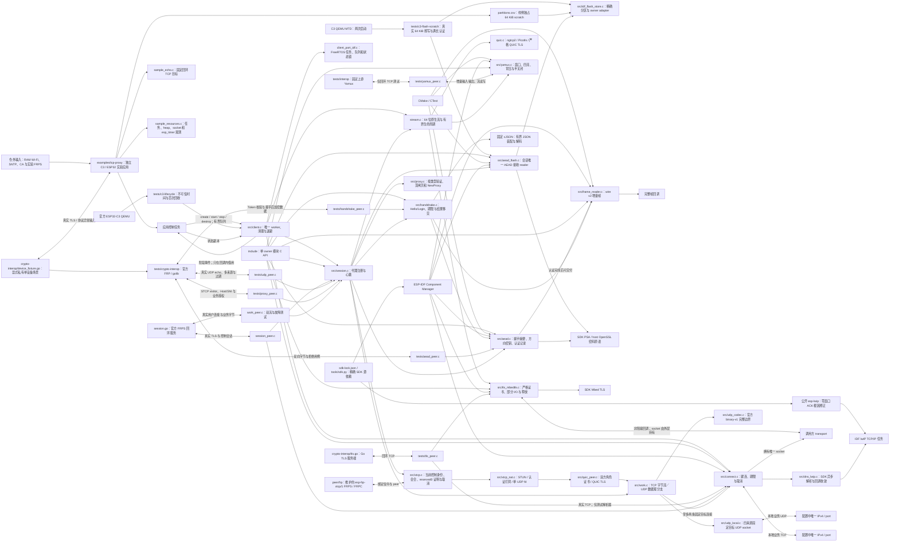

# ESP FRP

独立的 ESP-IDF FRP 客户端组件，采用 Apache-2.0。当前实现包含 wire v2 帧、有界 Yamux、Hello/Login、AES-256-GCM 控制记录、严格 TLS、单次 DNS/TCP 建连，以及类型化代理注册、Token 心跳和固定本地目标转发；单 worker 已组合生命周期与带抖动的重连。0.3.0 软件候选增加 UDP binary、STCP provider/visitor、HTTP/HTTPS 域名注册、原生 QUIC 流传输，以及与本仓维护 Go 对端消费 `esp-frp-xtcp/1` 的 XTCP provider/visitor；软件互测结果见[检查点](docs/verification/xtcp-candidate-software-20261003.md)，协议与实际对端边界见[协议扩展](docs/design/protocol-extensions.md)。独立 C3 的历史 TCP sample 已通过官方 FRPS 双流、DNS/TLS、部分异常协议及 `work-tail-fin` 实板互操作；ESP32-D0WD-V3 尚无实板结果。当前扩展、Base/MQTT 组合资源与长稳尚未验收，不能作为已验收 FRPC 发布。

## 架构拓扑



0.3.0 的状态不再持有固定 256 字节的 `remote_address` 数组。`remote_address_length` 报告完整长度，`efrp_get_remote_address`／`efrp_session_remote_address` 使用调用方缓冲区读取完整列表，容量不足返回所需长度并拒绝截断；清理会释放地址，STCP/XTCP provider 的合法响应地址为空。此候选尚未发布，也未升级 Base 的既有精确依赖。

组件 0.2.0 将可选配置字段硬切为 `run_id`，最大 64 UTF-8 字节，与官方 FRPS 合同一致。调用方可以提交稳定设备 UUID，使冷启动在完成严格 TLS 和 Token 鉴权后替换旧控制连接；状态中的 run ID 只报告已鉴权结果。官方 FRPS 旧连接存活与错误 Token 回归通过 host 检查，C3/Base 代表业务的联合 OTA／再次重启 FRP 恢复通过；来源下载最低历史 heap 4124 B，容量仍失败，见[稳定 run ID 检查点](docs/operations/stable-run-id-checkpoint.md)。

`esp_frp.h` 是应用入口：create 复制配置字节、字符串和回调表并创建一个空闲 worker，上下文借用到 destroy 成功；start 只表示命令入队。provider 的 READY 需完成注册和首次认证 Pong，visitor 还须绑定其本地 listener；XTCP 的 peer 直连状态由 `status.xtcp` 单独报告。stop 等待连接、迟到 DNS 和回调收敛；超时保留句柄和停止请求，destroy 成功后任务及配置均已释放。网络中断使用单个退避截止时刻，证书、认证和协议错误进入 failed。详见[客户端生命周期](docs/design/client-lifecycle.md)。

ESP 构建必须使用 [sdk-lock.json](sdk-lock.json) 锁定的 ESP-IDF v6.1 公开维护 fork `578cf89c343e388db43ba1f4ddcd602fedcb763c` 与公开 ESP lwIP 修正提交；fork 从官方 `fff9895c82d744c7237be8847347bdd1b07c6643` 派生，依次修复 `esp_ota_begin` 擦除失败后的句柄泄漏和 HTTP 客户端初始化失败时的传输句柄泄漏；准备及验证见 [SDK 工具](tools/README.md)。原 SDK 存在已实板复现的双向零窗口 ACK 循环。正式 SDK 同时采用组件锁定的 ESP Base 容量统计派生：本仓只保存唯一 recipe 的公开来源、精确提交和摘要，SDK 根 `esp-sdk-derivation.json` 与冻结 recipe 逐字相同；本仓 reader 先核完整清单，再核 IDF／lwIP／TLSF 的官方原文与实际派生字节、独立 Git 根、索引和全部子模块。未装配旧 SDK、部分或额外修改、清单漂移和外部 lwIP 覆盖均拒绝；检查不下载、不执行 SDK 脚本，也不从相邻 Base checkout 导入实现。该输入合同不改变本提交的 FRP 运行能力或授予组合容量资格。修正不改变 FRP/TLS 容量；最新独立样例双流压力测试的最低 heap 已超过 48 KiB，但 Base/MQTT 组合预算和完整实板矩阵仍待验收，详见 [C3 问题记录](docs/issues/c3-loopback-memory-pressure.md)。

## 独立开发

[独立 TCP 样例](examples/tcp-proxy/README.md) 面向 C3 与 ESP32-D0WD-V3，使用仓外输入装配 RAM Wi-Fi、可信 SNTP、严格 TLS 与回环 echo；支持重复创建、重启、网络中断和资源采样，不读取 Base 配置或写 NVS。样例专用 4 MiB 分区表含独占 `frp_scratch`，启动时核对并恢复后才允许联网；默认空输入只供编译，真实设备必须先核对其分区与恢复基线。ESP32 样例采用单核实验配置，目标构建与实板矩阵仍须分别验证。

[C3 生命周期故障探针](tests/c3-lifecycle/README.md)使用公开占位输入，在官方 QEMU 检查真实 FreeRTOS worker 的不可信时间拒绝和百次销毁回收；验证范围与实板边界见[运行记录](docs/operations/p4-c3-qemu-lifecycle.md)。

[C3 Flash scratch 探针](tests/c3-flash-scratch/README.md)在支持 ESP32-C3 的 QEMU MTD 上调用正式 IDF provider 与会话所用 Flash reader，完成独立实验分区的满长密文擦写、GCM 认证、窗口复验、坏 tag 拒绝与跨启动恢复；[运行记录](docs/operations/p6-c3-flash-scratch-qemu.md)明确区分该设备软件切片和完整 FRPS session、Base 产品分区及实板验收。

[会话与 IDF Flash provider 集成回归](docs/operations/p6-frp-session-idf-provider-interop.md)在 host 上让正式 session、正式 provider、严格 TLS 和官方 FRPS 同路运行，并对 64 KiB 正确/错误 tag 记录验证 Flash owner、清理与认证边界；它使用测试分区 shim，不代替 QEMU 或实板。

```bash
cmake -S . -B build -DBUILD_TESTING=ON
cmake --build build
ctest --test-dir build --output-on-failure
```

完整 TLS/QUIC 模式与 IDF 构建还须按 [QUIC 工具](tools/README.md)显式提供 `quic-lock.json` 固定的 ngtcp2/Picotls 源目录，运行时不从测试目录导入 helper。

依赖 C11 编译器、CMake >=3.20、OpenSSL >=3.0 开发库和 cJSON 1.7.19 开发包；非系统路径用 `-DOPENSSL_ROOT_DIR=...` 和 `-DCMAKE_PREFIX_PATH=...` 指定。无需 ESP、真实 Token、私有仓或相邻 checkout 即可运行 host 测试。IDF 组件入口为根 `CMakeLists.txt` 与 `idf_component.yml`，使用 SDK PSA 密码 API，并固定 `espressif/cjson ==1.7.19~2`；Token 协议需要启用 `CONFIG_MBEDTLS_MD5_C`，严格 TLS 必须开启 `CONFIG_MBEDTLS_HAVE_TIME_DATE=y`。固定 ESP-IDF v6.1 的空输入样例已分别通过 ESP32-C3 与 ESP32 target 编译；[双目标构建检查点](docs/operations/dual-target-sample-build.md)区分该软件证据和待完成的实板验证。PSA 与完整 Mbed TLS 后端也可用显式官方源码运行 host 测试，详见[测试入口](tests/README.md)。

`efrp_wire_init` 借用调用者缓冲区，输入指针不被保留。feed 支持拆帧与粘帧，只有完整帧才回调；EOF 用 finish 检查截断。最大 wire payload 为 65536 字节；header 与 payload 独立计数，非法输入后 reader 永久失败，必须重建连接再初始化。回调 payload 只在回调期间有效，不允许回调重入。该 parser 不是 TLS、Yamux 或 AEAD parser，不能将未经认证的 AEAD 明文直接交给它。

`esp_frp_yamux.h` 提供单 owner、无 socket 的客户端核心。四流上限不变，但只在打开每条流时分别申请 1 KiB 接收 ring，`release` 或最终 `destroy` 清零释放；打开流的分配失败返回 `EFRP_NO_MEMORY`，不消耗流 ID 或控制队列。协议初始窗口保持 256 KiB，可增量接收大于 ring 的 DATA。调用方定期 tick，显式消费串流和输出；仅当完整 WindowUpdate 已交给 transport 才归还接收信用。慢流超时 RST、释放后数据有界排空、半关闭与 PING/GOAWAY 均有 host 回归。完整合同和限制见 [Yamux 核心](docs/design/yamux-core.md)。

`esp_frp_aead.h` 对原始 Hello payload 做 SHA-256 摘要与 HKDF-SHA256 双向密钥派生，并提供发送端；nonce 来自密码随机源，单方向限制 2^32 条记录。控制会话的唯一接收 reader 在 `esp_frp_flash_reader.h`：独占 4096 字节 RAM 窗口，小记录直接认证，大记录把密文写入独占 64 KiB scratch，完整验签并在每次窗口交付前复验。完整 GCM tag 验证前不暴露明文，失败或取消后清零窗口与 key。仅支持协商 `aes-256-gcm`；Hello 语义由握手层验证。详见 [AEAD 合同](docs/design/aead-records.md)和[Flash 暂存合同](docs/design/flash-backed-aead.md)。

`esp_frp_idf_flash_store.h` 提供真实 IDF 分区 provider：调用方传入 label、type/subtype、精确 offset/size 和短持有的 storage owner 回调；bind 逐项核对实际分区，recover 擦除中断记录，write 回读校验，clear 只撤销 RAM lease。Base 可复用此 provider 并接自己的 owner，独立样例已绑定专用实验分区；它们仍需分别完成产品容量与实板验证。

[会话 Flash 硬切收据](docs/operations/p6-frp-session-flash-hard-cut.md)记录三种 host 后端、固定 SDK 双目标样例、相同非空合成输入的容量差异与尚未验收的设备边界。
[会话阶段复用检查点](docs/operations/p6-frp-session-phase-union.md)记录握手与 Flash 窗口复用后的对象尺寸、资源清理和官方协议回归。

[ESP32 会话 IRAM 放置检查点](docs/operations/p6-esp32-session-iram-placement.md)记录单核 8BIT IRAM 条件分配、签名 QEMU 的严格 TLS/FRPS 容量与正式 Base owner 尚未验证的边界。
[ESP32 工作流 IRAM 放置检查点](docs/operations/p6-esp32-work-iram-placement.md)记录 300,001 字节官方 FRPS 双向工作流、普通堆低水与正式 Base 组合尚未验证的边界。

`esp_frp_handshake.h` 生成 ClientHello/Login，验证 ServerHello/LoginResp 并移交方向密钥和 run ID。它必须运行在已完成严格认证的控制流上：TCP/TLS 使用 Yamux，QUIC 使用原生 bidi；不自行建立网络连接。UDP 明确协商 binary-v1，XTCP 候选只接受认证后服务端签发的当前控制身份。支持部分输出、10 秒绝对期限、4 KiB 握手 payload 上限和精确的加密尾数据保留；完整消费 LoginResp 后，余下字节交给 AEAD。会话将握手输出区按阶段复用为接收区，消除独立 4 KiB 申请。详见 [握手合同](docs/design/control-handshake.md)。

可选上游 Yamux 互操作检查需要 POSIX 宿主和 Go >= 1.23，以 `-DEFRP_TEST_UPSTREAM_YAMUX=ON` 配置后运行 CTest。AEAD 官方交叉验证使用 Go >=1.25 与 `-DEFRP_TEST_UPSTREAM_CRYPTO=ON`。两者各自固定公开 Go 依赖，不读取相邻仓或生产 FRPS；默认 host 检查不依赖 Go 或外网，POSIX 连接测试会使用回环 TCP。具体命令见[测试入口](tests/README.md)。

`esp_frp_tls.h` 对已连接的非阻塞 transport 提供严格 TLS；证书、身份、日期与 owner 的可信时间条件均须满足，1036 字节自有发送队列保持 SDK 重试指针稳定，握手/写入/关闭受绝对期限约束。终止后释放会话并停止回调，由外层关闭 socket。它不执行 DNS 或创建任务，详见 [TLS 合同](docs/design/tls-transport.md)。IDF 与显式 `EFRP_MBEDTLS_SOURCE_DIR` host 构建导出 `EFRP_HAS_TLS=1`；默认 OpenSSL/独立 PSA 构建只验证协议核心，导出 0 且不包含 TLS 符号。

`esp_frp_connect.h` 在 IDF 提供一次 IPv4 DNS/TCP 尝试，也支持无需 DNS 的固定 IPv4 本地目标，使用现有 lwIP 任务与非阻塞 socket；必须开启 `CONFIG_LWIP_SO_LINGER=y`。取消后不再建连，已发 DNS 查询仍须等 SDK 回调收敛，destroy 只在资源释放后成功；close_write/finish 提供工作流的正常半关闭和排空路径，不自行重连。详见 [连接生命周期](docs/design/connection-lifecycle.md)。IDF 导出 `EFRP_HAS_CONNECT=1`，正常 host 库为 0；host 网络测试单独链接仅测试解析器。应用客户端同样只在 IDF 导出 `EFRP_HAS_CLIENT=1`；POSIX 调度适配仅供测试。

`esp_frp_session.h` 在已 OPEN 的借用 transport 上组合控制链路，provider 注册单一类型化 proxy，visitor 使用独立角色；执行 15 秒 Token 心跳并校验 10 秒响应期限。`efrp_config_t` 到 session 的 Flash store 必填，启动 owner 必须先完成 recover。普通 provider 工作流执行 magic/NewWorkConn/StartWorkConn，TCP 类向唯一 IPv4/port 转发，最多两条活跃流和一条预备流；UDP 使用一条工作流和四个来源 socket。XTCP 先会合、打洞与双方证明，才开放 peer 业务；对端地址元数据不能更换固定本地目标。流 ID、背压、握手后尾数据与独立半关闭由统一流接口保持。destroy 返回 WOULD_BLOCK 或 STORAGE_ERROR 时继续保留句柄，直到本地 socket、peer native 引用与 Flash lease 清理完成，再销毁 transport 和其外层连接。详见 [控制会话](docs/design/control-session.md)、[工作流](docs/design/work-streams.md)与[协议扩展](docs/design/protocol-extensions.md)。该模块在 IDF 或完整 Mbed TLS host 模式编译；host 会话测试显式链接连接测试适配库，不把 DNS fixture 发布为 host runtime。

- [来源](docs/design/source-provenance.md)
- [客户端合同](docs/design/client-contract.md)
- [扩展 Roadmap](roadmap.md)
- [FRP 工程标准](https://github.com/darren-you/darren-space/blob/master/harness/docs/workspace/standards/frp/frp-golden-path.md)
