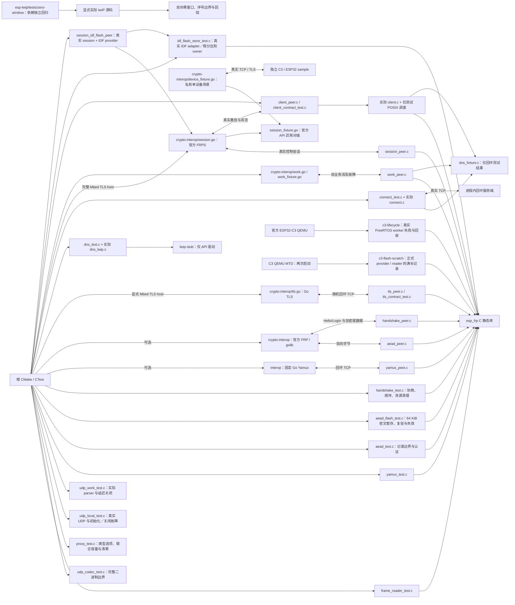

# ESP FRP 测试

## 架构拓扑



[C3 生命周期故障探针](c3-lifecycle/README.md)使用相同的 `esp-frp` 设备源码与 FreeRTOS port，在官方 QEMU 检验不可信时间拒绝和百次回收；这条设备软件路径不依赖 host POSIX 调度，结果见[运行记录](../docs/operations/p4-c3-qemu-lifecycle.md)。

[C3 Flash scratch 探针](c3-flash-scratch/README.md)使用正式 IDF 分区 provider 和当前 session 使用的 Flash reader，在两次 QEMU 启动中以同一个 MTD 文件验证 64 KiB 密文实写实读、满长 GCM、16 个窗口复验、坏 tag 与 boot recovery；[运行记录](../docs/operations/p6-c3-flash-scratch-qemu.md)保留固定工具链、原始证据摘要与完整会话未测边界。

默认 host 测试需 C11、CMake >= 3.16、OpenSSL >=3.0 和 cJSON 1.7.19 开发库；在仓库根执行：

```bash
cmake -S . -B build -DBUILD_TESTING=ON \
  -DCMAKE_C_FLAGS="-fsanitize=address,undefined -fno-omit-frame-pointer -g"
cmake --build build
ctest --test-dir build --output-on-failure
```

`aead_flash` 在 OpenSSL 与官方 PSA host 模式使用伪 Flash 覆盖大小边界、最大记录认证、读写/清理故障和模拟掉电恢复。`idf_flash_store` 直接编译真实 IDF adapter，配假 `esp_partition` 与 owner，覆盖精确分区、完整 64 KiB 记录及 17 次复读、OTA owner 占用时小记录无 scratch 访问、大记录写入或窗口复读中安全失败、写回读发现短写、clear 争用重试及 owner 错误漏调/重调/吞错。完整 Mbed TLS host 的 `session_upstream` 还让当前会话接收官方 64 KiB 控制记录，验证错误 tag 与 clear 失败时保留句柄重试；边界见 [Flash 暂存合同](../docs/design/flash-backed-aead.md)。

完整 Mbed TLS host 模式另有 `session_idf_flash_upstream`：正式 `session.c` 与正式 `idf_flash_store.c` 经测试分区 shim 组合，在随机回环端口与官方 FRPS 完成三轮注册/心跳，并用官方协议 fixture 验证 64 KiB 正确记录、64 KiB 错 tag 的零控制消息交付及小记录坏 tag。每轮重建 provider 并执行 boot recover，核对 owner 成对释放、64 KiB 擦写和逐窗口读取计数。运行范围与数据见[集成回归收据](../docs/operations/p6-frp-session-idf-provider-interop.md)。

[lwIP 零窗口回环回归](https://github.com/darren-you/esp-lwip/blob/master/tests/zero-window/README.md) 是单独的 SDK 缺陷复现入口，直接编译显式提供的依赖源码，不混入 FRP host 通过结论。原始官方 SDK 会失败；[sdk-lock.json](../sdk-lock.json) 已锁定通过该回归的修正源依赖，不用预期失败规则将原始 SDK 标绿。SDK 身份与脏内容守卫使用 `python3 -m unittest discover -s tools/tests -p 'test_*.py'` 验证。

OpenSSL 不在系统路径时添加 `-DOPENSSL_ROOT_DIR=/absolute/path/to/openssl`；cJSON 不在系统路径时用 `-DCMAKE_PREFIX_PATH=/absolute/path/to/cjson`。ESP-IDF 构建固定使用 SDK PSA API 与 manifest 中精确锁定的 espressif/cjson，不使用 OpenSSL。

POSIX host 默认另外运行 `connect`、`connect_linger` 与 `dns_adapter`，需要系统线程库。`connect` 使用真实 socket 与仅测试 DNS 结果；`connect_linger` 用 socket 操作注入验证 IDF 正 linger 的暂时性失败与取消所有权，不模拟 SDK TCP/IP 任务或五秒实板时长；`dns_adapter` 直接编译实际 lwIP 适配代码，使用 API fixture 驱动 SDK 回调次序。正常 host 库不包含这些 fixture 或 SDK 连接层。DNS 竞争可单独用 ThreadSanitizer 验证：

```bash
cc -std=c11 -Wall -Wextra -Werror -g -fsanitize=thread \
  -Iinclude -Isrc -Itests/lwip-stub \
  src/dns_lwip.c tests/dns_test.c -pthread -o /tmp/esp-frp-dns-tsan
/tmp/esp-frp-dns-tsan
```

ASan 与 TSan 需分别构建。上述驱动验证所有权及竞争，不计作真实 SDK DNS 网络或 C3 调度验证，范围见 [连接生命周期](../docs/design/connection-lifecycle.md)。

AES-256-GCM 和 Hello/Login 官方互操作需 Go >=1.25，添加 `-DEFRP_TEST_UPSTREAM_CRYPTO=ON`，运行 `aead_upstream`、`handshake_upstream` 和 `handshake_esp32_upstream`。后两项分别以 `riscv32`、`xtensa` 核对官方 FRP v0.71.0 解码出的 Login，并完成 Token 鉴权、加密往返与拒绝用例；两方向、64 KiB、多记录及拒绝范围见 [crypto-interop](crypto-interop/README.md)。可以同时打开两个上游测试选项。

生产 PSA 适配器也能在 host 运行相同 CTest。使用 [受控完整 host 来源](../tools/README.md#quic-精确源码)中的 `tf-psa-crypto` 精确子目录，其官方 `tf-psa-crypto-1.1.0` source tag 基线为 `29160dd877d29658279fd683b2ae57b320ddcf09`，与原独立官方发布包版本一致。当前源码保留19个生成文件、发布配置及密码原语；C/头文件/汇编与原官方包逐文件相同。独立 PSA 准备可只指定 host 组，不取不消费的 QUIC：

```bash
python3 tools/quic_sources.py prepare --host-mbedtls-path /absolute/path/to/mbedtls-4.1.0
```

显式传入其精确 PSA 子目录：
```bash
cmake -S . -B build-psa -DBUILD_TESTING=ON \
  -DEFRP_PSA_SOURCE_DIR=/absolute/path/to/mbedtls-4.1.0/tf-psa-crypto \
  -DGEN_FILES=OFF -DEFRP_TEST_UPSTREAM_CRYPTO=ON \
  -DCMAKE_C_FLAGS="-fsanitize=address,undefined -fno-omit-frame-pointer -g -DMBEDTLS_PSA_ASSUME_EXCLUSIVE_BUFFERS"
cmake --build build-psa
ctest --test-dir build-psa --output-on-failure
```

显式 PSA host 模式不再链接 OpenSSL。发布包包含生成文件，`GEN_FILES=OFF` 避免把上游代码生成工具引为本项目依赖。不要把 Espressif SDK 内经移植的 TF 子树当作独立官方 host 包；它依赖 SDK 的头文件与配置，生产芯片适配只由 IDF 编译验证。上面两个构建目录选择不同密码后端，用于交叉验证。

严格 TLS 测试使用 [受控 Mbed TLS 4.1.0 完整源归档](https://github.com/darren-you/reference-sdk-mbedtls/releases/tag/v4.1.0)，SHA-256 为 `91773900004719afbae4821f1671a9a3cb04c674208be1d3e7598c53ce199668`。按 [普通准备入口](../tools/README.md#quic-精确源码)取得完整精确 Git 源，入口同时核验正式归档与重建一致性；清理只移除 Actions 来源并保留全部官方生成文件，2 处生成注释差异见来源记录。包内自带 TF-PSA-Crypto 1.1.0，不得同时设置 `EFRP_PSA_SOURCE_DIR`。需 POSIX 与 Go >=1.25：

```bash
cmake -S . -B build-tls -DBUILD_TESTING=ON \
  -DEFRP_MBEDTLS_SOURCE_DIR=/absolute/path/to/mbedtls-4.1.0 \
  -DEFRP_NGTCP2_SOURCE_DIR=/absolute/path/to/locked-ngtcp2 \
  -DEFRP_PICOTLS_SOURCE_DIR=/absolute/path/to/locked-picotls \
  -DGEN_FILES=OFF -DEFRP_TEST_UPSTREAM_CRYPTO=ON -DEFRP_TEST_UPSTREAM_YAMUX=ON \
  -DCMAKE_C_FLAGS="-fsanitize=address,undefined -fno-omit-frame-pointer -g -DMBEDTLS_PLATFORM_MEMORY -DMBEDTLS_PSA_ASSUME_EXCLUSIVE_BUFFERS"
cmake --build build-tls
ctest --test-dir build-tls --output-on-failure
```

该模式自动增加 `tls_upstream`，由 Go 标准 TLS 服务端生成临时 CA/证书并启动 C peer；包含 TLS 1.2/1.3、四类证书拒绝、部分 I/O、100 次连接、取消和期限。`MBEDTLS_PLATFORM_MEMORY` 仅为 host 分配失败注入；未开启时不执行分配注入段，其余合同测试仍执行。PSA 的独占输入模式与 SDK 对齐。TLS 测试总期限 180 秒，证书输入和监听均在测试内清理，详见 [TLS 合同](../docs/design/tls-transport.md)。

完整 Mbed TLS 模式也增加 `session_upstream`，总期限 240 秒。它在本机启动实际官方 FRPS，验证百次注册、Token 心跳、工作请求、部分 I/O、拒绝和取消；另有 29 种尾数据、容量、Yamux 非法 header、解析、认证、Flash 清理失败、EOF 和超时场景。host 配置使用公开 fixture，监听仅回环，子进程和临时证书结束后清理；范围见 [控制会话](../docs/design/control-session.md)。[单设备入口](crypto-interop/README.md#单设备协议-fixture) 可用显式私有配置复用协议场景；它不负责刷机，服务端成功也不等于设备验收。

同一模式的 `work_upstream` 用实际 FRPS 验证 100 轮双业务流，共 200 条本地连接，每流双向各 300001 字节；总期限 240 秒。`work_faults_upstream` 总期限 180 秒，包含四个真实 FRPS 拒绝/取消场景和 13 个官方 API 半关闭、尾数据、解析、期限与慢流场景。连接目标是独立回环业务 listener；正常结束与取消均检查 fd 基线，详情见 [工作流](../docs/design/work-streams.md)。

`work_allocation` 对三个工作槽的首次分配失败、待办请求保留、取消清零释放及重复取消做定向检查；完整 Mbed TLS 模式的 `work_upstream` 和 `work_faults_upstream` 覆盖实际 FRPS 工作流与背压。设备容量由当前固件、完整业务并发和双目标实测核对。

同一候选源码下的完整 host/local 压力与工作流矩阵结果、精确复现命令和实板边界见 [P4-04 主机工作流矩阵](../docs/operations/p4-host-workflow-matrix.md)。

可选互操作需 macOS/Linux 与 Go >= 1.23；`tests/interop/go.mod` 和 `go.sum` 固定 FRP v0.71.0 的实际 Yamux replacement。首次运行可能下载该公开依赖，不读取生产配置或相邻源码：

```bash
cmake -S . -B build -DBUILD_TESTING=ON -DEFRP_TEST_UPSTREAM_YAMUX=ON
cmake --build build
ctest --test-dir build --output-on-failure
```

Go 测试启动随机回环 TCP 端口和本仓构建的 C peer，结束时回收进程、连接与监听；CTest 有 120 秒总期限。上游测试验证其实际 6 MiB 最大窗口配置与本核心 1 KiB ring 的互操作。该测试没有 TLS、FRP wire 登录或真实 MCU；边界和验收范围见 [Yamux 核心](../docs/design/yamux-core.md)。

完整 Mbed TLS 模式另外运行 `client_upstream`（240 秒）和 `client_contract`。前者使用实际 `client.c`、POSIX 测试调度和实际 FRPS，验证百次创建/注册/停止/销毁、同实例重复 start、双向业务和活动双流取消、真实 FRPS 重启恢复，以及 DNS 迟到、退避、取消、并发调用、回调收敛和信任/认证终止。活动流重启场景在两条业务流各交付一字节后关闭真实 FRPS，确认旧本地与远端 socket 关闭、worker 退避并重新注册，再由同一实例完成两条新的双向 300001 字节业务流；超时不算关闭成功。后者检查配置边界、三个 host 创建分配点失败及配置清零。长退避阶梯通过仅测试单调时钟推进，实际 FRPS 恢复使用真实时钟。测试解析器不发送真实 DNS 查询，pthread 不能代替 FreeRTOS 的实机资源证明。

可以把完整 Mbed TLS 命令中的 `-fsanitize=address,undefined` 替换为 `-fsanitize=thread`，在独立构建目录运行 `ctest --test-dir <目录> -R '^client_' --output-on-failure`，检查 worker、外部 API、状态副本与迟到测试 DNS 的竞争。不可同时开启 TSan 和 ASan。停止和线程退出检查见[客户端生命周期](../docs/design/client-lifecycle.md)。

`session_peer` 将实际 `session.c` 的对象分配单独替换为测试计数器；TLS、密码与对端保持真实。首轮分别注入会话对象和 Yamux 分配失败，再验证握手配置拒绝回滚；握手结束后，Flash reader 的 4096 字节窗口复用握手所占联合区，并与控制 wire parser 的 `json_rx` 同时保持独立。正常/失败/取消会话销毁均检查持有对象已清零且无残留，clear 失败时保留 session handle 后重试。`aead_flash` 覆盖记录边界、满长坏 tag 和 lease 争用。

## 协议扩展软件测试

默认 host 矩阵增加 `udp_codec`、`proxy_config` 和 POSIX `udp_local`；后者使用真实 UDP，注入 socket 创建、非阻塞设置与 IDF 关闭暂时失败，验证失败所有权和 fd 基线。完整 Mbed TLS 模式增加 `udp_work`／`udp_work_close`，分别验证拆帧/粘帧、合法超限排空、非法 metadata 拒绝、来源过期、取消和保留 fd 时业务缓冲清零。

`udp_codec_upstream` 随 `EFRP_TEST_UPSTREAM_CRYPTO=ON` 开启，官方 FRP v0.71.0 编码与 C codec 双向交叉验证最大数据报、地址/zone及拒绝用例。完整 TLS 模式的 `udp_upstream`（180 秒）验证实际 FRPS 数据报、多来源隔离、容量、超限、突发和 66 秒真实空闲。`udp_client_upstream`（120 秒）单独验证实际 worker 活动来源中断、同实例重连、累计计数与当前 gauge/fd 清理。它们的结果单独记录，不能引用 TCP 回归代替 UDP 恢复证据。

`proxy_upstream`（180 秒）运行 TCP、STCP provider、HTTP 与 HTTPS 的真实 FRPS 互测。STCP visitor 来自官方 frpc；Host/SNI 路由、错密钥/user、未知目标、重复注册、并发大响应、业务授权与超过 256 字节的完整注册列表分别断言。HTTPS 正常关流服务明确发送 close_notify 后 TCP 半关闭并排空对端；不因此声明任意 abrupt close 都正常完成。

单独调试在 `tests/crypto-interop` 执行 `go run -mod=readonly . -udp-codec-peer /absolute/path/to/udp_codec_peer`、`-udp-peer /absolute/path/to/udp_peer`、`-udp-client-peer /absolute/path/to/udp_client_peer` 或 `-proxy-peer /absolute/path/to/proxy_peer`。当前单设备 fixture 仍只消费已声明的 TCP 场景；这些 host 扩展入口不自动取得设备访问或刷写授权。合同和实板边界见[协议扩展](../docs/design/protocol-extensions.md)。

## 原生 QUIC 与扩展候选

完整 Mbed TLS 模式从正式 `src/stream*`、`src/quic*` 构建。`stream_yamux` 验证真实后端的物理 EOF、待消费尾数据、半帧截断、诊断及实际期限；`work_stream` 验证零号和高位 stream ID、打开背压、延迟 release、立即关闭本地 socket/清零与有界槽保留。测试适配器只在 `tests/` 中使用。

`quic_transport_upstream` 由 quic-go 驱动正式 C 后端，包含正常与错误证书链/主机名/日期/KU/EKU/ALPN/签名、双流长数据、调用方覆盖已接受缓冲、ACK 后复用、接收背压、丢包/乱序、reset 和完整超长数据报拒绝。`quic_client_upstream`、`quic_udp_client_upstream`、`quic_stcp_visitor_upstream` 使用完整正式 C client/session/work 和精确官方 FRPS 源构建的独立进程，覆盖业务、活动取消及实际进程退出/同端口重启。子进程退出才能证明所有 FRPS QUIC socket 被关闭；官方 `Service.Close` 不关闭全部已有 QUIC 连接，不能替代进程重启。软件测试与两个真实 ESP 的资源、网络和 Base 组合验收分别记录。

`quic_cleanup_posix` 用真实 OS 释放并复用同编号 socket，验证 `close` 返回错误后重复 cancel/destroy 不会误关新 owner；同一 fixture 在旧代码上实际失败。`quic_cleanup_idf` 单独编译正式 lwIP 所有权分支，以保留的真实 socket 验证关闭失败时 WOULD_BLOCK、诊断、五秒以后仍保留句柄及最终重试释放。后者使用 host syscall fixture，SDK 语义另从固定 lwIP 源核对；它不代替设备上的失败注入。五秒只约束 QUIC 关闭报文，DNS／SDK socket 仍须等真实释放才允许销毁。

`xtcp_binding`／`xtcp_codec` 使用正式密码后端和有界 JSON 验证 canonical manifest、双方控制身份/nonce/SPKI、可信时间窗口、TLS exporter proof、真实 Go 错误响应及严格拒绝。`xtcp_nat` 通过实际 UDP/STUN 和认证探测，验证单 socket 所有权、合法 mode 0、错误 nonce、期限及清理。它们各自只证明对应组件。

完整 Mbed TLS 模式的 `quic_peer_security`／`quic_peer_transport_upstream` 验证正式身份生成、双方真实证书/CV 和绝对握手期限；`xtcp_direct_work_upstream` 消费双方 reserved0 canonical proof 和两条 300001 字节业务流，覆盖十类错绑／截断／尾随证明拒绝及真实 native stream credit 背压。`xtcp_client_upstream` 则运行完整公共 C provider/visitor、实际维护 FRPS 严格 TLS/Token 控制身份、STUN、会合、打洞、双方证明、双流业务、同实例停止／重启、可信时间撤销和 fd 基线。错误 Token、FRPS 主机名及未可信时钟验证控制建立失败与停止收敛；访问 secret/user/target 的负例另实测独立 XTCP 拒绝及 backend 连接数为零。跳过 C peer 不算通过。

原官方 XTCP 认证边界的真实源码复现由 `python3 tests/xtcp/run_official_fixtures.py` 运行；本仓候选已使用 `esp-frp-xtcp/1` 与硬切信令，实际对端是 [peer/frp](../peer/frp/candidate-development.md)，不能写成原样官方 XTCP 互操作。

2026-10-03 最终 QUIC 关闭修正后，正式 ASan/UBSan Mbed TLS 完整矩阵单次 52/52 通过（71.94 秒），包含完整 XTCP 公共 C 双角色及两项关闭所有权回归。此前 49 项及单独完整 XTCP 1 项通过的原始证据独立保留。OpenSSL 基线 21/21 通过（5.37 秒），该模式不消费 QUIC 源码。结果、精确复现输入及两个 ESP target 的编译／容量边界见[软件检查点](../docs/verification/xtcp-candidate-software-20261003.md)。这些 host 结果不代替两板运行资源、异网 NAT 或 Base 组合验收。

[public_consumer_contract.py](public_consumer_contract.py) 使用真实父级 CMake/C++ 工程验证公共头和实验 trace 宏的传播，分别编译、链接 TRACE OFF/ON；程序不运行。该回归针对库与外部消费者状态结构大小不一致的 ABI 缺口，不在子目录中借用隐式编译定义。它只需本机 CMake、C/C++ 编译器、OpenSSL 和固定 cJSON；临时工程自动清理，依赖前缀可显式指定：

```bash
python3 tests/public_consumer_contract.py --cmake-prefix-path /path/to/local/dependencies
```
