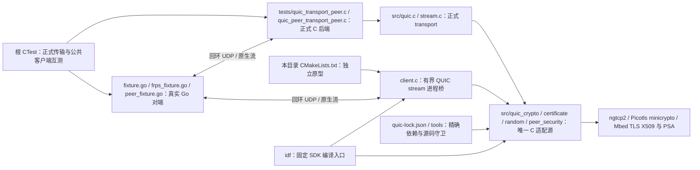

# 严格 QUIC 传输原型

本目录保留独立传输原型与正式后端的定向 fixture。固定 ngtcp2/Picotls 通过 minicrypto 和 Mbed TLS X509/PSA 实现严格 QUIC TLS 1.3；正式 `session/work/client` 已使用统一原生 stream 接口，官方 FRPS 的完整 C TCP、UDP、STCP visitor host 互测由根 CTest 执行。设备运行、资源测量和真实异网验收尚未完成，不能登记为通过硬件验收的生产传输。

## 架构拓扑



原型进程桥、正式 bare transport/peer fixture 与完整公共客户端各有独立验收范围；后者从根 CTest 启动，不用进程桥代替 C Login、AEAD 或 controller。

## 源码与安全边界

- [quic-lock.json](../../quic-lock.json) 冻结 ngtcp2 v1.25.0 受控完整提交 `5d5a3cf0faf44e06bf94137d5ff15e5edc5c6c24`（原上游业务基线 `f9e9ff01ad2c8116bc09de4f644b0028a61486a6`）、Picotls 受控完整提交 `7b5899d9b5f16f75e23548cf53ff05c0575a5ecd`（原上游业务基线 `f07f1c8c68b237f1468bc1f1fe1b68aba3ff23b4`），以及 host Mbed TLS 4.1.0 官方完整发布归档 SHA-256。依赖必须放在仓外；构建拒绝版本漂移和未提交修改。
- [quic_crypto.c](../../src/quic_crypto.c) 是本仓正式模块与原型共用的唯一 ngtcp2/Picotls helper 实现，来自固定 ngtcp2 的 `crypto/picotls/picotls.c`，保留 MIT 许可与来源，直接使用 `ptls_minicrypto_*`。它不改写依赖、不创建 OpenSSL 符号别名，也不编译官方依赖 OpenSSL 的 helper。
- [quic_random.c](../../src/quic_random.c) 使 context、X25519 和 helper 共用 PSA 随机源。PSA 初始化或生成失败直接终止；不能继续使用未初始化输出。
- [quic_certificate.c](../../src/quic_certificate.c) 先用官方 Mbed TLS 验证 CA 链、域名、有效期与 KU/EKU 用途，再验证真实 TLS `CertificateVerify`。公开窄边界是 ECDSA P-256/SHA-256；哈希由 PSA 生成，DER ECDSA 由官方 `mbedtls_pk_verify` 转换并交 PSA 验签。没有跳过签名验证的路径。最多 4 个证书、单证书 8192 字节、链总计 16384 字节；时间可信回调在验链和验签时都必须成立。
- client 只配置 AES-128-GCM/SHA-256、X25519、ALPN `frp`，不启用 0-RTT、会话票据或自行信任证书。未支持的签名方案由 TLS 协商拒绝。
- host 和 ESP 编译同一套第一方 C helper、验签与随机源。未引入 C++、nghttp3、libev、OpenSSL、GPL 或 wolfSSL 后端。

原型发现并在自有 helper 内消除了两项真实后端差异：minicrypto AES-ECB 已在 `setup_crypto` 初始化且不存在 IV 回调，不能沿用 OpenSSL helper 的 ECB `ptls_cipher_init`；PSA 验签输入是定长 `r || s`，TLS 输入是 DER，不能直接传给 `psa_verify_hash`。

## Host 复现

先用 [tools/quic_sources.py](../../tools/quic_sources.py) 在两个不存在的新目录创建精确依赖，或对已有 checkout 执行 `check`：

```sh
python3 tools/quic_sources.py prepare \
  --ngtcp2-path /tmp/esp-frp-quic-ngtcp2 \
  --picotls-path /tmp/esp-frp-quic-picotls
```

host Mbed TLS 使用根 `quic-lock.json` 的受控 4.1.0 完整生成源码。通过 [普通 prepare](../../tools/README.md#quic-精确源码)的 `--host-mbedtls-path` 完整物化精确 Git 与全部子源，实际核正式 Release 归档与重建摘要。官方生成文件和 TF-PSA 依赖保留，普通未生成 Git 归档不能替代；配置只接受该固定完整来源：

```sh
cmake -S tests/quic-prototype -B /tmp/esp-frp-quic-host \
  -DEFRP_NGTCP2_SOURCE_DIR=/tmp/esp-frp-quic-ngtcp2 \
  -DEFRP_PICOTLS_SOURCE_DIR=/tmp/esp-frp-quic-picotls \
  -DEFRP_MBEDTLS_SOURCE_DIR=/tmp/mbedtls-4.1.0 \
  -DCMAKE_C_FLAGS='-fsanitize=address,undefined -fno-omit-frame-pointer -g'
cmake --build /tmp/esp-frp-quic-host -j8
cd tests/crypto-interop
go run -race ../quic-prototype/fixture.go ../quic-prototype/frps_fixture.go \
  -peer /tmp/esp-frp-quic-host/quic_client
```

Go 使用现有 `crypto-interop/go.mod` 的官方 FRP v0.71.0 和 quic-go v0.60.0 精确依赖。所有监听均为本机 loopback；CA、密钥和 token 都是临时公开测试数据，不读取设备或真实服务配置。

2026-10-02 实际通过 ASan/UBSan 与 Go race 检查：

| 验收 | 结果 |
| --- | --- |
| 官方 quic-go：严格握手、两条 bidi 各 4096 字节双向与独立 FIN | 通过，`certificate=1 signature=1 handshake=1 dual_fin=1` |
| 错误域名、过期、未来生效、错误 CA、客户端 EKU、禁止数字签名的 KU | 在验链阶段拒绝，`signature=0 handshake=0` |
| 公钥匹配证书、实际用另一私钥签署的 TLS CertificateVerify | 在真实验签阶段拒绝，`certificate=1 signature=1 handshake=0` |
| 未可信时间、错误 ALPN | 拒绝，没有完成握手 |
| 官方 FRPS：v2 Hello/Login、控制 AEAD、注册 TCP 代理 | 通过 |
| 同一 FRPS QUIC 连接：两条原生 bidi work，各 4096 字节回显及 FIN | 通过，没有叠加 Yamux |

[frps_fixture.go](frps_fixture.go) 通过有界进程桥使用 C QUIC stream。Go 官方 `wire/msg/auth/AEAD` 负责 FRP 协议；C 负责 CA/hostname/date/CertificateVerify、QUIC packet 与原生 stream I/O。因此 FRPS 互通证据不等于正式 C `Login/AEAD/session/client` 集成验收。

进程桥最多 3 条 stream，每条发送数据最多 16384 字节，并保留不可变发送区直至连接释放，保证 ngtcp2 重传时的借用数据仍有效。它只服务当前有限 fixture。正式 [quic.c](../../src/quic.c) 使用每条 RX 1024/TX 2048 字节环形缓冲，发送数据复制后保持不变，真实 ACK 回调才回收；`release` 等待 native close 回调清除借用。桥退出前要求两条 work 都已收到 FIN。正式后端的 reset、方向性 STOP_SENDING 和单次 encrypted CONNECTION_CLOSE 取消使用专属 fixture 验证。

## 固定 ESP-IDF 编译

使用项目 [sdk-lock.json](../../sdk-lock.json) 和 [tools/sdk.py](../../tools/sdk.py) 通过检查的独立 SDK，不能使用其他框架目录。`idf` 项目构建前自动执行 SDK 守卫。每个 target 使用独立构建目录和仓外 sdkconfig：

```sh
source /path/to/verified-esp-idf/export.sh
idf.py -C tests/quic-prototype/idf -B /tmp/esp-frp-quic-c3 \
  -DIDF_TARGET=esp32c3 -DSDKCONFIG=/tmp/esp-frp-quic-c3/sdkconfig \
  -DEFRP_NGTCP2_SOURCE_DIR=/tmp/esp-frp-quic-ngtcp2 \
  -DEFRP_PICOTLS_SOURCE_DIR=/tmp/esp-frp-quic-picotls build
idf.py -C tests/quic-prototype/idf -B /tmp/esp-frp-quic-esp32 \
  -DIDF_TARGET=esp32 -DSDKCONFIG=/tmp/esp-frp-quic-esp32/sdkconfig \
  -DEFRP_NGTCP2_SOURCE_DIR=/tmp/esp-frp-quic-ngtcp2 \
  -DEFRP_PICOTLS_SOURCE_DIR=/tmp/esp-frp-quic-picotls build
```

2026-10-02 ESP32-C3 和 ESP32 完整链接均通过。`compile_main.c` 仅保留整个 client 的链接引用，不调用 host fixture，也未刷写或连接任何设备。此结果证明工具链装配，不能证明硬件上的握手、堆/栈、性能或长期可用性。

实际装配事实：Picolibc 有一个无关同名 `picotls.h`，TLS 库头使用明确的 `-I` 优先级；socket 等待使用 host/ESP 共有的 `select`。固定第三方源有两类诊断：ngtcp2 未消费的 `ksl_print` 调试函数用 `%u` 打印 Picolibc 的 `unsigned long uint32_t`，Picotls 用合法 C 部分聚合初始化；仅这两个文件分别使用 `-Wno-error=format` 和 `-Wno-error=missing-field-initializers`，保留 warning 与其他错误门。没有修改固定依赖源码，也没有把该调试函数接入正式输出。当前完整候选的双目标构建结果另见[软件检查点](../../docs/verification/xtcp-candidate-software-20261003.md)，本节原型记录不代替正式候选资源验收。

## 正式原生 stream 合同

[esp_frp_transport.h](../../include/esp_frp_transport.h) 提供两个真实后端的 public factory/lifecycle；[stream_internal.h](../../src/stream_internal.h) 是 `session/work/client` 共用的内部 stream 合同。TCP/TLS 映射 Yamux，QUIC 映射原生 bidi。stream ID 使用 uint64，`UINT64_MAX` 为 NONE，保留合法 QUIC stream 0。

| 操作 | 必须闭合的语义 |
| --- | --- |
| `open(transport, out_stream)` | 仅认证完成后创建 bidi；stream 数量或对端 credit 不足返回 `WOULD_BLOCK`，不能额外分配无界队列 |
| `read(stream, bytes, capacity, out_length)` | 读取有界接收区；应用实际消费后才归还 stream/connection flow credit；缓冲排空后才报告远端 FIN/EOF |
| `write(stream, bytes, length, out_length)` | 只接受能进入有界持久发送区的字节；ACK 回调回收区间；重传借用数据在 ACK 前保持不变 |
| `close_write(stream)` | 对本地发送方向排队一次 FIN，已接受的发送尾部数据仍须送出；不关闭读方向 |
| `reset(transport, stream_id)` | 显式终结应用收发并报告 reset；QUIC 的原生借用引用仍保留至 close 回调或连接清理，不能提前释放发送 ring，也不会伪装 EOF |
| `release(stream)` | 双 FIN 且接收区排空，或 reset 后可请求释放；QUIC 还必须等待 native close。WOULD_BLOCK 保留槽位及借用引用，连接停止按取消合同统一回收 |
| `step(transport, monotonic_ms)` + `status.next_deadline_ms` | 在唯一 owner 中处理 ngtcp2 expiry、握手、idle、应用取消和 pacing；返回下一次 timer/发送期限 |
| UDP 收发 | 保留完整 datagram、路径与目标地址；拒绝截断；发送背压保留整包直至成功后更新 tx time，不能丢弃或重复计时 |

2026-10-03 正式后端 20 项 host 定向互测通过 ASan/UBSan 和 Go race：严格 FRPS TLS、514062 字节双流传输、整包丢失与重排、reset、截断 UDP 拒绝、STOP_SENDING(0) 正负方向边界，以及取消的 EAGAIN/EIO/绝对期限收敛。取消丢弃旧业务输出，只保留一次 CONNECTION_CLOSE；最迟 5s 丢弃该关闭包并清除协议借用和业务缓冲。此组 host fixture 的 socket 关闭成功，不能据此给迟到 DNS 或 SDK socket 关闭承诺五秒资源上限；未收敛资源仍需保留 owner 并重试。

候选 XTCP peer 独立使用 [esp_frp_quic_peer.h](../../include/esp_frp_quic_peer.h) 的 typed factory，provider 是 QUIC server，visitor 是 client。PSA 私钥保持 opaque，双方真实 CertificateVerify 都必须通过；单 DER≤1024、P256/SHA256、自签、角色 SAN/KU/EKU、真实日期和本次 SPKI pin 是 signal admission 与 TLS handshake 共用合同。ALPN 固定 `esp-frp-xtcp/1`，不沿用官方未绑定 peer 的 `frp`。24 项真实 peer fixture 覆盖双方角色、70034 字节双流/FIN及证书和握手负例；delayed Initial 不能延长从 factory 开始的 10s 绝对期限。

这些 bare peer fixture 只以 exporter digest 检查传输，不能代替完整 XTCP reserved0 双角色 69 字节 proof。[tests/xtcp](../xtcp/README.md) 的 direct-work fixture 才消费正式 canonical manifest/exporter/proof 与维护 Go `ExchangeProof`。完整公共 C 客户端的信令/STUN/会合/证明/业务串联另由 `xtcp_client_upstream` 验证，已通过维护候选互测；入口与范围见[软件检查点](../../docs/verification/xtcp-candidate-software-20261003.md)。硬件资源和异网验收继续沿主方案执行；第一方 helper 在本仓单一归属，依赖 checkout 保持原始精确源，不在构建期生成或改写第三方文件。
