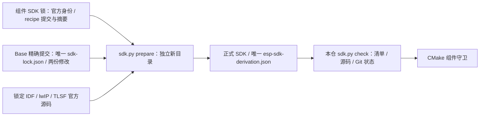

# SDK 准备与检查

`tools/sdk.py` 只消费本仓 [sdk-lock.json](../sdk-lock.json)、Python 标准库、Git 和锁定的公开来源。组件锁保存 IDF／lwIP 身份，以及 ESP Base 唯一 recipe 的来源提交与完整摘要；TLSF、两份修改与逐文件原文／派生摘要只存在于该 recipe。组件不保存第二套 patch 清单或脚本。



```bash
export PYTHONDONTWRITEBYTECODE=1
python3 tools/sdk.py prepare --path "$HOME/.espressif/frameworks/esp-frp-idf"
bash "$HOME/.espressif/frameworks/esp-frp-idf/install.sh" esp32c3 esp32
source "$HOME/.espressif/frameworks/esp-frp-idf/export.sh"
python3 tools/sdk.py check --path "$IDF_PATH"
python3 -B -m unittest discover -s tools/tests -p test_sdk.py
```

`prepare` 只创建不存在的新路径，从冻结 Base 提交读取 recipe 和两份修改的数据，不执行 Base 构建或 SDK 内脚本。它核对清单与 patch 摘要、所有官方原文及完整修改集合，在全部 `git apply --check` 通过后才应用；最后独占创建 SDK 根普通文件 `esp-sdk-derivation.json`，其字节与冻结 recipe 完全相同。工具链安装与导出仍是独立的官方入口。

`check` 只读本地 SDK：先核该普通文件的完整摘要，再核官方 IDF／lwIP／TLSF 提交、逐文件原文与派生摘要、索引、精确工作树差异及所有子模块；不下载、不执行未知脚本，不调用相邻仓库。未装配旧 SDK、清单缺失／链接／漂移、部分修改、未声明修改及子模块漂移均拒绝。既有路径和失败现场保持，不提供自动修复、可选 allowlist 或旧门回退。`--quiet` 供构建调用，仅省略成功输出。

真实 Git fixture 覆盖独立准备、精确来源与逐文件校验，以及原始 lwIP、脏状态、索引、TLSF、清单、链接、部分修改和越界路径等拒绝；它不下载真实 SDK、不触达设备。软件守卫通过不授予 FRP／Base 组合容量、Broker 或实板资格。


来源检查使用完整原生 Git 对象、HEAD 原始树、索引，以及实际源码字节、类型、执行位和符号链接目标；逐个递归来源拒绝 shallow／partial／sparse、缺失或被改写对象、借用对象库、外置或无绑定元数据、replace／grafts、Git 来源环境重定向，以及包括 ignored 在内的所有未跟踪内容。absorbed 子模块只接受根来源自身的 Git modules 与原生 core.worktree 绑定；独立子模块保留自身 `.git`。sparse／promisor 按 Git 作用域、include 和原生布尔语义核对最终有效值，完整来源允许有效的 false，partial clone filter 标记仍拒绝。`prepare` 完整取得根与递归精确 gitlink，不使用 shallow 获取；唯一 stamp 为 `0400` 的普通文件，其内容与冻结 recipe 逐字相同。

从 SDK 安装与导出前设置 `PYTHONDONTWRITEBYTECODE=1`，后续 `idf.py`、CMake 和独立 Ninja／`cmake --build` 保留该环境，避免 SDK 来源出现 Python 缓存；来源检查仍拒绝所有 ignored 内容。真实临时 Git 回归同时核对 schema2 派生与这些严格来源边界，不下载真实 SDK，不授予固件、Broker、双板容量或实板资格。

## QUIC 精确源码

0.3.0 的完整 Mbed TLS host 模式和 ESP-IDF 组件都消费 [quic-lock.json](../quic-lock.json) 中同一组 ngtcp2/Picotls。完整 TLS/QUIC host 模式使用三个不存在的仓外目录（仅 IDF 的 QUIC 准备可省略 host 参数；独立 PSA 模式只准备 host 组）：

```bash
python3 tools/quic_sources.py prepare \
  --ngtcp2-path /absolute/path/to/esp-frp-ngtcp2 \
  --picotls-path /absolute/path/to/esp-frp-picotls \
  --host-mbedtls-path /absolute/path/to/mbedtls-4.1.0
```

`prepare` 以无 filter、无 depth 的完整提交与递归精确 gitlink 物化受控来源；ngtcp2、Picotls 及真实命中的 URL 解析子源各自保留原上游完整提交追溯，普通 C/TLS 源码不变。已有目录用 `check` 替代 `prepare`，不会覆盖或修改 checkout。host `cmake` 和 IDF `idf.py` 均添加 `-DEFRP_NGTCP2_SOURCE_DIR=/absolute/path/to/esp-frp-ngtcp2` 与 `-DEFRP_PICOTLS_SOURCE_DIR=/absolute/path/to/esp-frp-picotls`。构建检查独立 Git 根、完整 SHA 和未提交修改，不能用相邻工作区或改写依赖来绕过守卫。基础 OpenSSL／独立 PSA 协议矩阵不消费 QUIC。

原型和正式组件共用根锁、源守卫及第一方 crypto；正式装配由 `tools/quic_dependencies.cmake` 定义；原型仅作为独立测试入口。两个 target 并行构建需各自独立源码目录，不能共享 Component Manager 的 `managed_components` 目录。实际运行、资源与验收范围见[流传输合同](../docs/design/stream-transport.md)。

SDK 的 Actions 退出来源以原 `esp-space/esp-idf@578cf89c343e388db43ba1f4ddcd602fedcb763c` 为业务基线，只追加源码退出与实际嵌套来源绑定；受控来源的 `workspace-source.json` 保留精确上游追溯。lwIP 锁需在源码退出 PR 合入 `darren-you/esp-lwip` canonical `master` 后再选择精确版本，当前不使用未合并任务 head；源码变更不代表固件、Broker、实板或发布已完成。

host Mbed TLS 保持官方 4.1.0 / TF-PSA 1.1.0 业务版本，来源为既有受控仓的精确 host source commit 与 [原生完整源 Release](https://github.com/darren-you/reference-sdk-mbedtls/releases/tag/v4.1.0)。`prepare` 完整物化 Git 与精确子源，实际读取锁定 Release 归档并核摘要，再从该 Git 源重建归档比对；不会保留平行缓存。31 个官方生成文件与 `GEN_FILES=OFF` 合同完整，2 处生成注释归位差异在源仓 `workspace-source.json` 明示，不能称与官方包逐字节相同。`check` 和构建守卫独立从固定 Git 版本的干净完整递归来源重建归档并核对同一摘要，无需网络或先前 `prepare` 成功；来源不得通过 alternates 或环境借用其他对象库，不能用原含 Actions 的官方归档代替。上述取源不授予 TLS/Broker/固件或设备运行资格。
